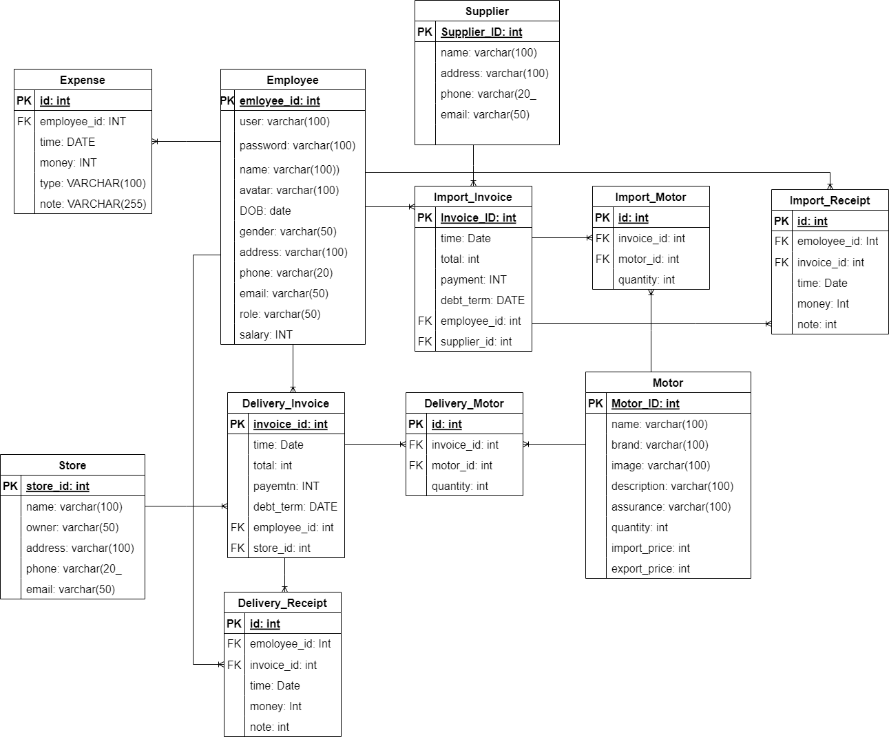

# Motorcycle-dealer-manager-MISD-PTIT
- Thiết kế hệ thống: Các tệp pdf
https://www.canva.com/design/DAFcSgsBSuY/dfenHzkRr1k4s4IQSq9XfQ/edit
https://www.canva.com/design/DAFgzqm7S90/cVCrgREzGYqicni6ew_B_w/edit
- Sơ đồ cơ sở dữ liệu cho hệ thống:

- Các bước để có thể sử dụng:

Bước 1: Cài đặt python

Bước 2: Cài đặt các thư viện trong file requiments.txt

Bước 3: Cấu hình cơ sở dữ liệu

    - Tạo cơ sở dữ liệu: create database motorcycle_manager;
    - Thay đổi các cài đặt tại phần DATABASE trong tệp setting.py
    - Tạo các bảng trong database: py manage.py migrate
    - Nhập dữ liệu vào cơ sở dữ liệu: Nhập các tệp trong thư mục database hoặc chạy tệp import_data.py
Bước 3: Chạy server

py manage.py runserver

