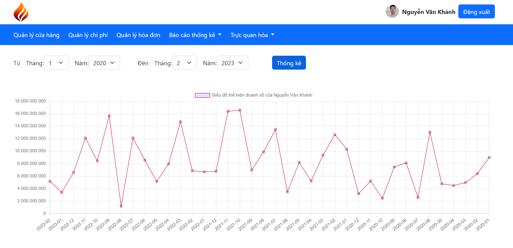
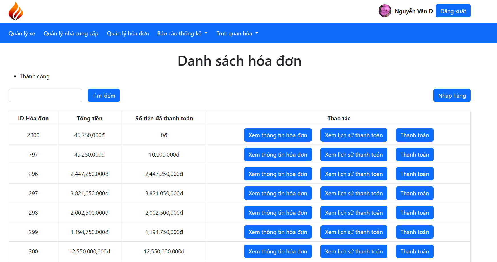

# Motorcycle-dealer-manager-MISD-PTIT

- Thiết kế hệ thống: Các tệp pdf

https://www.canva.com/design/DAFcSgsBSuY/dfenHzkRr1k4s4IQSq9XfQ/edit

https://www.canva.com/design/DAFgzqm7S90/cVCrgREzGYqicni6ew_B_w/edit

- Sơ đồ cơ sở dữ liệu cho hệ thống:
  
- Các bước để có thể sử dụng:

Bước 1: Cài đặt python

Bước 2: Cài đặt các thư viện trong file requiments.txt

Bước 3: Cấu hình cơ sở dữ liệu

    - Tạo cơ sở dữ liệu: create database motorcycle_manager;
    - Thay đổi các cài đặt tại phần DATABASE trong tệp setting.py
    - Tạo các bảng trong database: py manage.py migrate
    - Nhập dữ liệu vào cơ sở dữ liệu: Nhập các tệp trong thư mục database hoặc chạy tệp import_data.py

Bước 3: Chạy server

py manage.py runserver

- Các chức năng trong có hệ thống
    - Các chức năng của admin
        - Quản lý nhân viên
          
        - Xem báo cáo thống kê
            - Xem thống kê thu chi theo tháng
              
            - Xem lịch sử bán hàng của nhân viên
              
            - Xem các mặt hàng bán ra theo tháng
              
            - Xem mặt hàng bán chạy
              
            - Xem lịch sử nhập hàng của nhân viên
              
        - Xem trực quan dữ liệu
            - Trực quan thu chi
              
            - Trực quan doanh số của nhân viên theo tháng
              
            - Trực quan mặt hàng bán chạy theo tháng
              
            - Trực quan mặt hàng bán chạy
              
            - Trực quan số lượng đã nhập theo cửa hàng
              
            - Trực quan lượng hàng đã nhập theo từng nhà cung cấp
              
        - Xem hệ thống khuyến nghị
            - Dự đoán sản phẩm
              
            - Dự đoán nhà cung cấp
              
    - Các chức năng của nhân viên bán hàng
        - Quản lý cửa hàng
          
        - Quản lý chi phí
          
        - Quản lý hóa đơn xuất hàng
          
        - Xem báo cáo thống kê
            - Báo cáo mặt hàng đã bán theo tháng(giống với admin)
            - Báo cáo mặt hàng bán chạy(giống với admin)
            - Xem lịch sử bán hàng
              
        - Xem trực quan hóa
            - Trực quan mặt hàng đã bán theo tháng(giống admin)
            - Trực quan mặt hàng bán chạy(giống admin)
            - Trực quan số lượng hàng đã bán cho từng cửa hàng(giống admin)
            - Trực quan kpi
              
    - Các chức năng của nhân viên kho
        - Quản lý xe
          
        - Quản lý nhà cung cấp
          
        - Quản lý hóa đơn nhập hàng
          
        - Xem báo cáo thống kê
            - Xem lịch sử nhập hàng
              
        - Xem trực quan hóa
            - Trực quan số lượng hàng đã nhập của từng nhà cung cấp(giống admin)